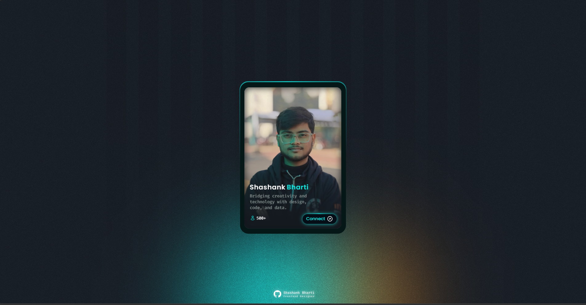
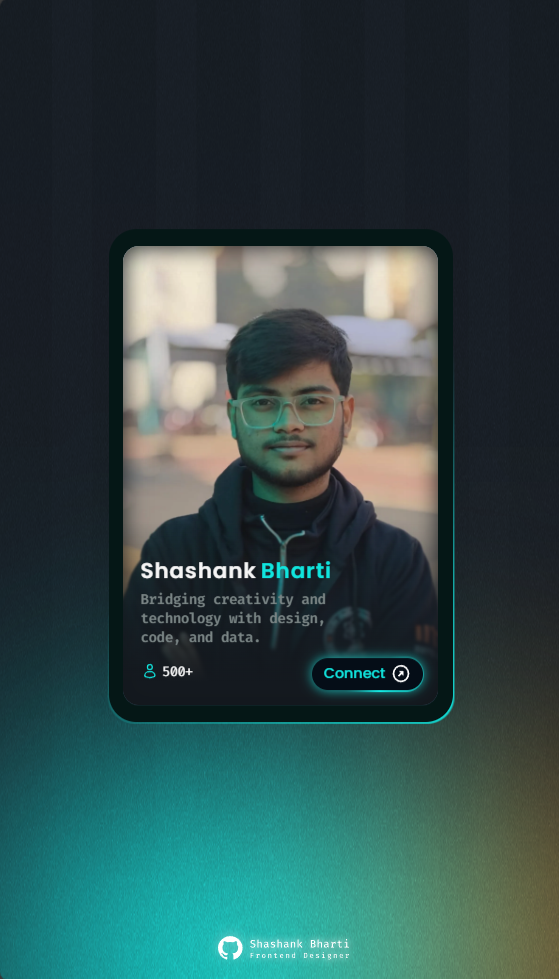

# Profile Card 

A modern, responsive profile card with smooth animations and interactive hover effects. Built with HTML and CSS.


## ✨ Features

- **Smooth Animations**: Fluid transitions 
- **Responsive Design**: Works perfectly on desktop and mobile devices
- **Modern UI**: Clean, minimalist design with gradient backgrounds
- **Social Integration**: Open Graph meta tags for social media sharing


## 🚀 Demo

[Live Demo](https://shashank-bharti.github.io/Profile-Card/)

## 📸 Screenshots

### Desktop View


### Mobile View



## 🛠️ Technologies Used

- **HTML5**: Semantic markup structure
- **CSS3**: Advanced styling with animations and transforms
- **Google Fonts**: Poppins and Fira Code font families

## 📁 Project Structure

```
Profile-Card/
├── index.html          # Main HTML file
├── info-card.html      # Alternative card layout
├── style.css          # All styling and animations
├── images/            # Image assets
│   ├── pfp1.webp      # Profile picture
│   ├── graintexture.png   # Background texture
│   ├── Frame 7.svg    # Background stripes
│   ├── bxs-group.svg  # Group icon
│   └── bx-right-top-arrow-circle.svg # Arrow icon
├── README.md          # Project documentation
└── .git/             # Git repository
```

## 🎯 Installation & Setup

1. **Clone the repository**
   ```bash
   git clone https://github.com/Shashank-Bharti/Profile-Card.git
   cd Profile-Card
   ```

2. **Open locally**
   - Simply open `index.html` in your web browser
   - Or use a local server for development:
   ```bash
   # Using Python
   python -m http.server 8000
   
   # Using Node.js
   npx http-server
   
   # Using Live Server (VS Code Extension)
   # Right-click on index.html and select "Open with Live Server"
   ```

3. **Access the project**
   - Local file: `file:///path/to/your/project/index.html`
   - Local server: `http://localhost:8000`

## 🎨 Customization

### Changing Profile Information

Edit the content in `index.html`:

```html
<div class="inner-section">
    <span class="name">
        <h3>Your First Name</h3>
        <h3>Your Last Name</h3>
    </span>
    <p>Your custom description here</p>
    
</div>
```

### Customizing Colors

Modify the CSS variables in `style.css`:

```css
:root {
    --primary-bg: #14191F;
    --card-bg: #051716;
    --accent-color: #10e5de;
    --text-color: #ffffff;
    --secondary-color: #fb7d0e;
}
```

### Adjusting Animation Settings

Fine-tune the animation parameters:

```css
@keyframes floatingCard {
    /* Adjust floating distance */
    0%, 100% { transform: translateY(-25px); }
    50% { transform: translateY(25px); }
}

.card-container {
    /* Modify animation duration */
    animation: floatingCard 4s ease-in-out infinite;
}
```

### Adding Social Links

Update the connect button in `index.html`:

```html
<span class="right-btn">
    <a href="https://your-social-link.com" target="_blank">Connect</a>
    
</span>
```

## 🔧 Features Breakdown


### Responsive Design
- Mobile-first approach
- Flexible layouts using CSS Grid and Flexbox
- Optimized touch interactions

### Performance
- Hardware acceleration with CSS transforms
- Efficient animation loops
- Optimized image formats (WebP)

## 📱 Browser Support

- ✅ Chrome 90+
- ✅ Firefox 88+
- ✅ Safari 14+
- ✅ Edge 90+
- ⚠️ Internet Explorer (Limited support)

## 🤝 Contributing

1. Fork the repository
2. Create your feature branch (`git checkout -b feature/AmazingFeature`)
3. Commit your changes (`git commit -m 'Add some AmazingFeature'`)
4. Push to the branch (`git push origin feature/AmazingFeature`)
5. Open a Pull Request

## 🐛 Known Issues

- Minor performance impact on older mobile devices
- Misaligned rendering of inner card social button in Opera Browsers
- Some animation jitter on Firefox (working on fix)


## 👨‍💻 Author

**Shashank Bharti**
- GitHub: [@Shashank-Bharti](https://github.com/Shashank-Bharti)
- LinkedIn: [Shashank Bharti](https://www.linkedin.com/in/shashank-bharti-iitp)

## 🙏 Acknowledgments

- Inspiration from modern card UI designs
- Google Fonts for typography
- CSS-Tricks for animation techniques
- MDN Web Docs for technical references

## 📊 Performance Metrics

- **Lighthouse Score**: 95+ Performance
- **Load Time**: < 1.5s on 3G
- **First Contentful Paint**: < 1s
- **Animation FPS**: 60fps smooth

---

⭐ If you found this project helpful, please give it a star on GitHub!

**[⬆ Back to Top](#profile-card---interactive-3d-card-animation)**
